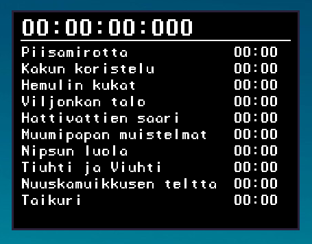

# SeedSplit
Simple timer with splits, useful for speedrunning



## Installation (building)
You need to have [Birb2D](https://github.com/Toasterbirb/Birb2D) library installed (version 0.1.1) and boost_filesystem from the [boost](https://www.boost.org/) library.

```
make -j$(nproc)
```

## Adding splits
Split files go to ~/.local/share/SeedSplit

For example: ~/.local/share/SeedSplit/taikurin_hattu.splits

One split per line. Example (check the screenshot for reference):
```
Piisamirotta
Kakun koristelu
Hemulin kukat
Viljonkan talo
Hattivattien saari
Muumipapan muistelmat
Nipsun luola
Tiuhti ja Viuhti
Nuuskamuikkusen teltta
Taikuri
```

## Usage
Just run the SeedSplit binary in the build directory. Give the name of the chosen split list as the first argument. For example, if you had a splitfile "taikurin_hattu.splits", you would run the program like this: `./SeedSplit taikurin_hattu`.

To start the timer, hit Spacebar. Hitting spacebar again goes to the next split until there are no splits left.

Resetting the timer etc. will probably be implemented in the future(tm)
