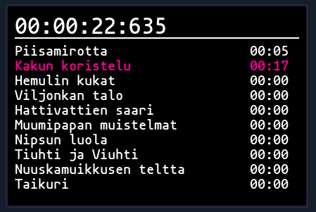

# SeedSplit
Simple timer with splits, useful for speedrunning


## Installation (building)
You need to have [Birb2D](https://github.com/Toasterbirb/Birb2D) library installed (version 0.1.1).

```
make -j$(nproc)
```

## Usage
Just run the SeedSplit binary in the build directory. Give the name of the chosen split list as the first argument. For example, if you had a splitfile "taikurin_hattu.splits", you would run the program like this: `./SeedSplit taikurin_hattu`.

To start the timer, hit Spacebar. Hitting spacebar again goes to the next split until there are no splits left.

Resetting the timer etc. will probably be implemented in the future(tm)

## Adding splits
Split files go to ~/.local/share/SeedSplit

For example: ~/.local/share/SeedSplit/taikurin_hattu.splits

One split per line. Example (check the screenshot for reference):
```
Piisamirotta
Kakun koristelu
Hemulin kukat
Viljonkan talo
Hattivattien saari
Muumipapan muistelmat
Nipsun luola
Tiuhti ja Viuhti
Nuuskamuikkusen teltta
Taikuri
```

## Configuration
You can configure the program by editing a config.ini file located at ~/.local/share/SeedSplit. It's not created automatically, so you will need to create the file if you want to change something.

Here is an example configuration file:
```
[Theme]
Font = /usr/share/fonts/TTF/mononoki-Bold.ttf
TimerSize = 32
SplitSize = 20
SplitSpacing = 1

; RGB color values for the current split highlighting
CurrentSplitR = 255
CurrentSplitG = 1
CurrentSplitB = 155
```

This configuration would result in SeedSplit looking like this



## External libraries
- [inipp](https://github.com/mcmtroffaes/inipp)
